Author: [Luna Huang](https://github.com/lunayuehuang/OpenAI/) Acknowledgement: Henry Stirrat, Yueyao Fan 

# Using Document Intelligence and OpenAI to acquire information from a pdf file. 
In this tutorial, we demonstrate how Azure Cognitive Service "Document Intelligence" and "OpenAI" can be used to extract information from a PDF file, such as a scientific manuscript.  

### Learning Objectives
By the end of this tutorial, you will be able to:
- Use Azure Document Intelligence to extract structured text from PDF documents
- Deploy and access Azure OpenAI models through the Azure OpenAI service
- Combine document extraction with large language models to retrieve targeted information from scientific PDFs
- Design and evaluate prompts to test information retrieval from research publications

## Part 1 Document Intelligence 
Azure AI Document Intelligence, formerly known as Form Recognizer, is a cloud-based service offered by Microsoft Azure. It leverages advanced machine learning technologies to automatically extract text, key-value pairs, tables, and structures from various documents. This service simplifies the process of converting unstructured documents into usable data, enabling businesses to focus more on utilizing information rather than compiling it. Document Intelligence supports both pre-built models for common document types and custom models that can be tailored to unique document structures. This service can be applied in numerous scenarios including cloud-based or edge deployments, making it versatile for different IT architectures and business needs​​.

Begin by navigating to the Azure portal (https://portal.azure.com) and logging in with your Azure account credentials. Once logged in, you can access various Azure services, including Document Intelligence. 

Search for Document Intelligence and click ```Create```

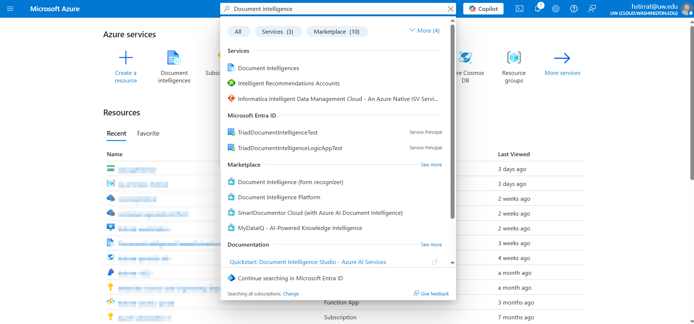

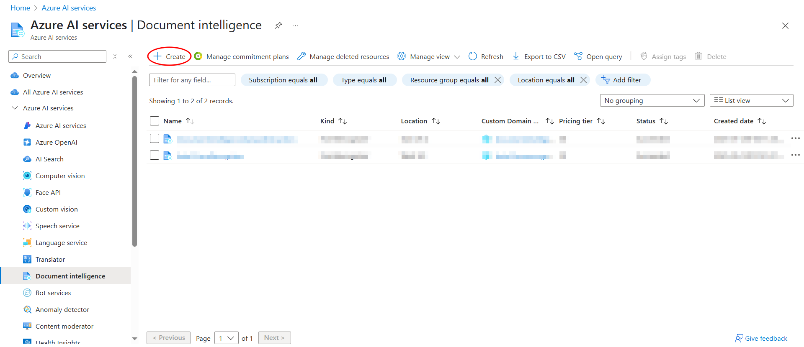

Fill out the options as shown in the image below (note: the "Free F0" may not be available; if so, please choose the Standard S0 pricing tier)

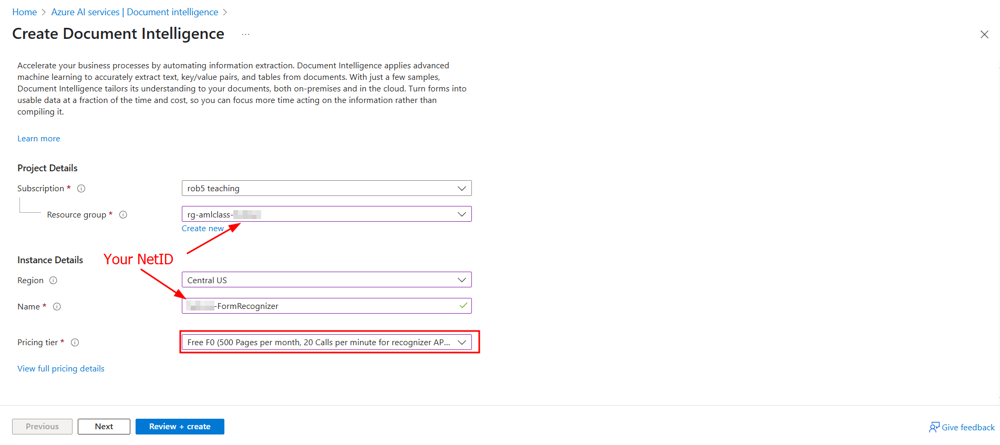

Keep other options as default, and click ```create```

To use this service, you will need the endpoint and key of the resource you created; here is how to find it: Navigate to your resource group main page, and in the list of the resource you created, find the Document Intelligence service you just created; select it, and find the API and Key information in Resource Management/keys and Endpoint

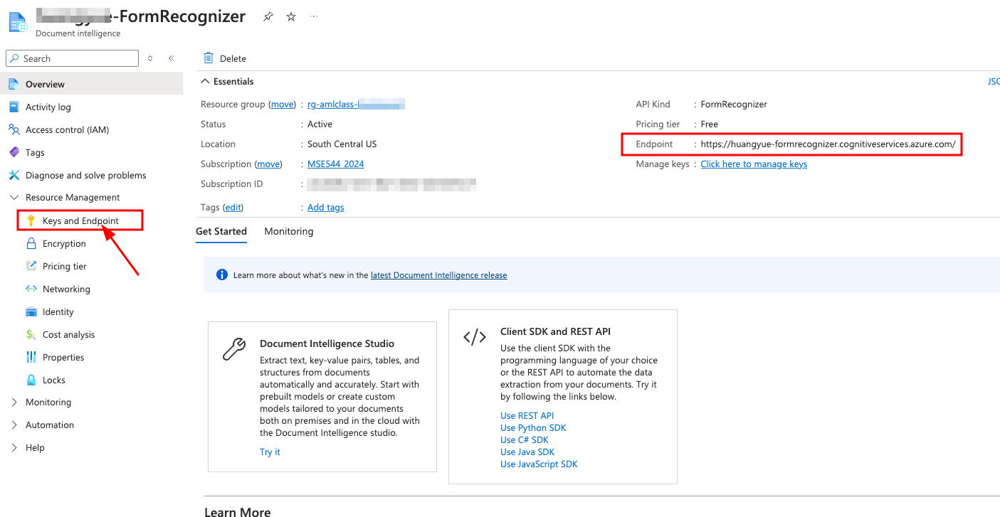

You can copy the key directly using the icon on the right. 

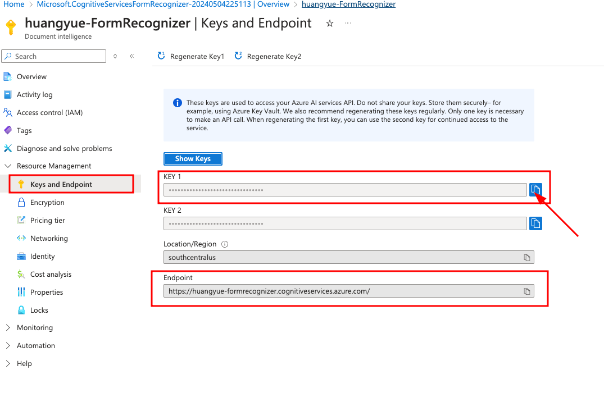


## Part 2 Introduction to the OpenAI API 
The OpenAI API is a powerful tool that provides access to state-of-the-art artificial intelligence models developed by OpenAI. It allows developers to integrate cutting-edge AI capabilities into their applications with ease. Some key capabilities of the OpenAI API include:

1. Natural Language Understanding and Generation: The API can understand and generate human-like text, making it useful for tasks such as text completion, translation, summarization, and question answering.
2. Text Classification: It can classify text into predefined categories or labels, enabling applications to automatically categorize and organize large volumes of text data.
3. Image Recognition: With models like CLIP (Contrastive Language-Image Pre-training), the API can understand the content of images and provide textual descriptions or classify images into categories.
4. Customization and Fine-Tuning: Developers can fine-tune the pre-trained models provided by OpenAI to adapt them to specific tasks or domains, allowing for more tailored and accurate AI solutions.
5. Scalability and Performance: The API is designed to handle large-scale requests efficiently, making it suitable for applications with high throughput and demanding computational requirements.

## Part 3 Using OpenAI with Azure
OpenAI's powerful artificial intelligence capabilities are now available through Microsoft Azure. If you already have an Azure subscription, integrating OpenAI into your applications is straightforward. This introduction will guide you through the process of getting started with OpenAI on Azure.

### Step 3.1: Accessing OpenAI Resources on Azure

Begin by navigating to the Azure portal (https://portal.azure.com) and logging in with your Azure account credentials. Once logged in, you can access various Azure services, including OpenAI resources.

### Step 3.2:Create an OpenAI Resource 

In the Azure portal, search for "OpenAI" in the service catalog to explore available OpenAI resources. You'll find services such as the OpenAI API, which provides access to AI models like GPT-4 and CLIP, as well as other related services.

 
In your resource group, click Create: 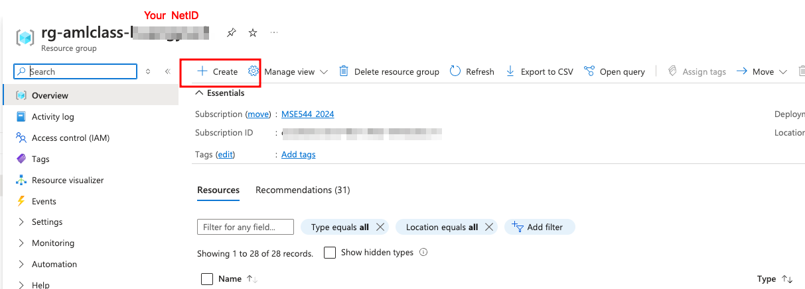

Next in the marketplace, search for OpenAI and select Azure OpenAI 

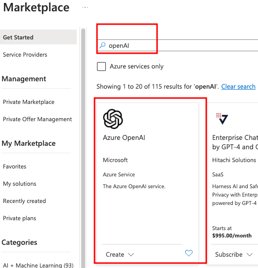


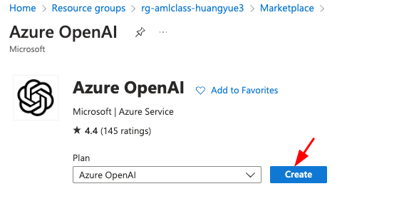

Create the resource using the following settings. There is a limit of 30 deployments per region per subscription so not all students will be able to use the same region. Additionally, not all models are available in all regions. To streamline this and avoid running into these limits, we ask that students registered for CHEM 443/543 use East US, while students registered for MSE 479/544 use East US 2. If you run into issues with either of these, West US also has the model we will be using:

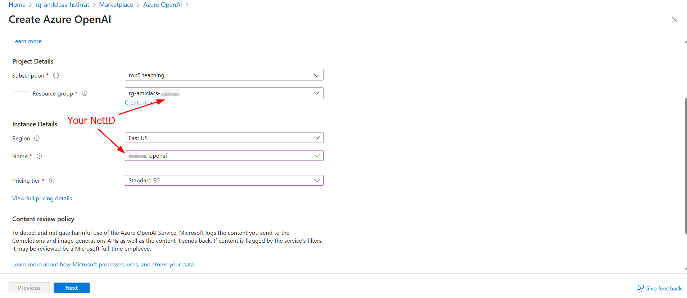

If your resource is created successfully, you will see this page:
 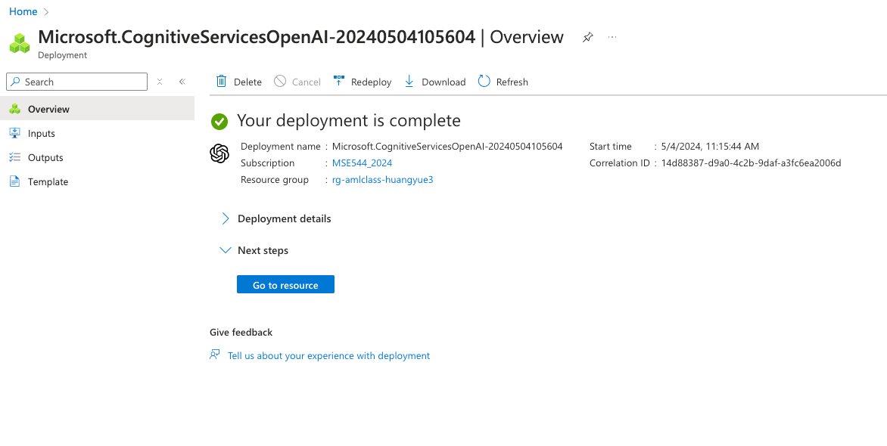

### Step 3.3: Create Azure OpenAI Deployment 

To use OpenAI, you also need to select the ML model you want to use on the Azure OpenAI portal, in what is called a "Deployment". Azure OpenAI Deployment is a service offered by Microsoft Azure that facilitates the integration and deployment of OpenAI models within Azure's cloud infrastructure. This service enables developers to easily deploy, scale, and manage OpenAI models for various applications such as natural language processing, image recognition, and more.

Go to Azure OpenAI Studio (https://oai.azure.com/portal). The first time you log in, you will be asked to log in with your UW microsoft account and choose the subscription of this class and the OpenAI resource you just created. Navigate to ```Deployments``` in the left bar and click ```Deploy model``` then ```Deploy base model```.

 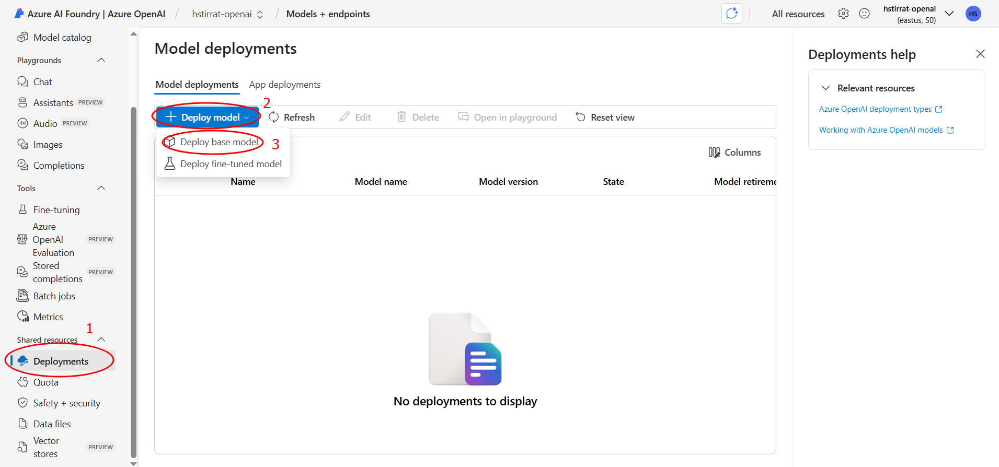

Select ```o3-mini``` then on the next page name you deployment as <yourNetID>-o3-mini

 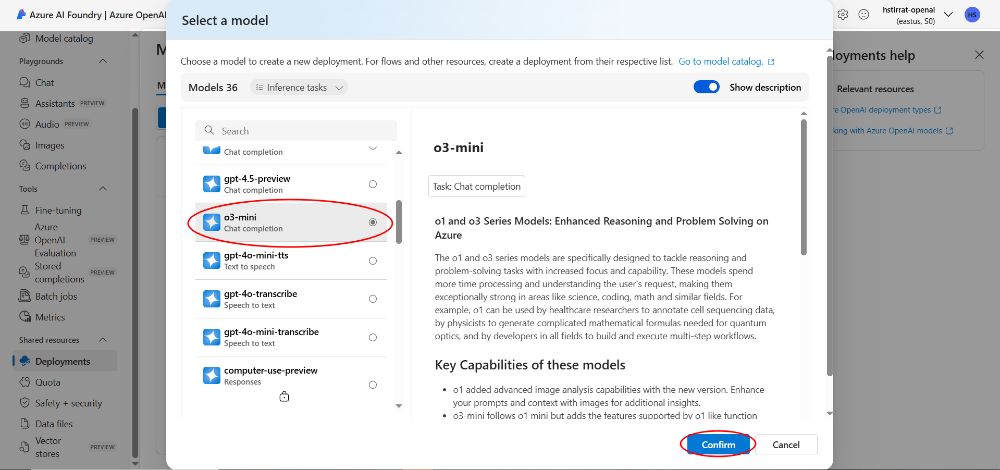

  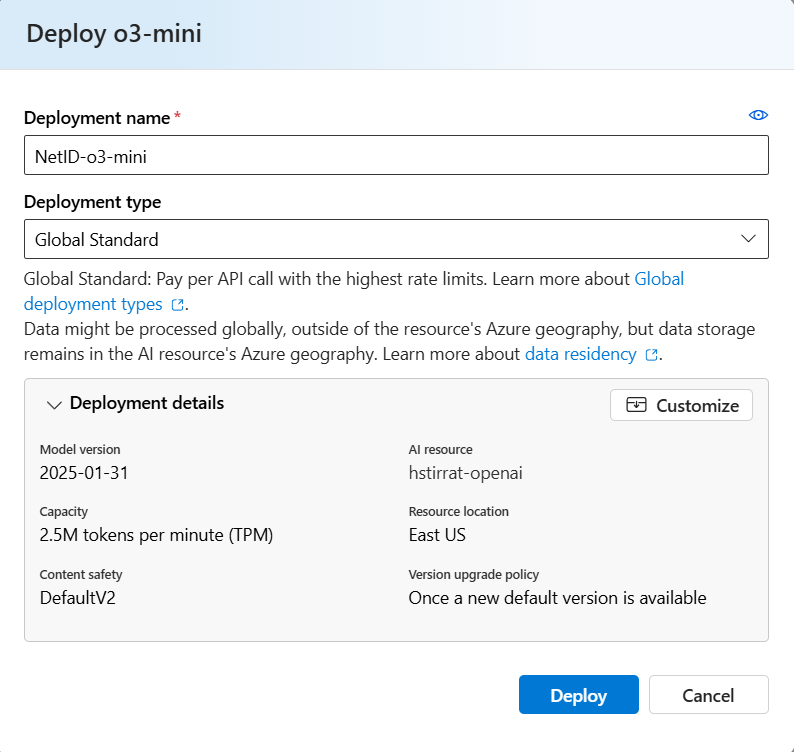

Once your delpoyment is created, you can find the key and endpoint. Remember the name of the Azure OpenAI deployment, which will be used when accessing the resource. 

Now you have everything you need to try Document Intelligence and Azure OpenAI. Below are the steps to run this demo that produces a relevance ranking, meaning the model estimates which document is more relevant to a given query or topic. 

1. Clone the repository:
   https://github.com/lunayuehuang/OpenAI  
   or download the demonstration notebook directly:
   https://github.com/lunayuehuang/OpenAI/blob/main/PdfExtractionTutorial_Demo.ipynb

2. Download the two PDF files used in this demo:
   - https://github.com/lunayuehuang/OpenAI/blob/main/PapersToAnalyze/15.pdf
   - https://github.com/lunayuehuang/OpenAI/blob/main/UnridableBicycle.pdf

3. Place the notebook in a directory and create a subdirectory named `PapersToAnalyze`, then move the PDF files into that folder.

4. Create a new Python environment, open `PdfExtractionTutorial_Demo.ipynb`, and update it with the endpoint, key, and deployment name of the resources you created.

5. Run the notebook to obtain relevance rankings of the two PDF files for a topic of interest. 


Now, go ahead and try changing the prompt, so that you can use this notebook to get information from a research publication that you are familiar with, and design a test to analyze if you can use OpenAI to get the information you are interested in from a publication, and write a short report to analyze the results. 


